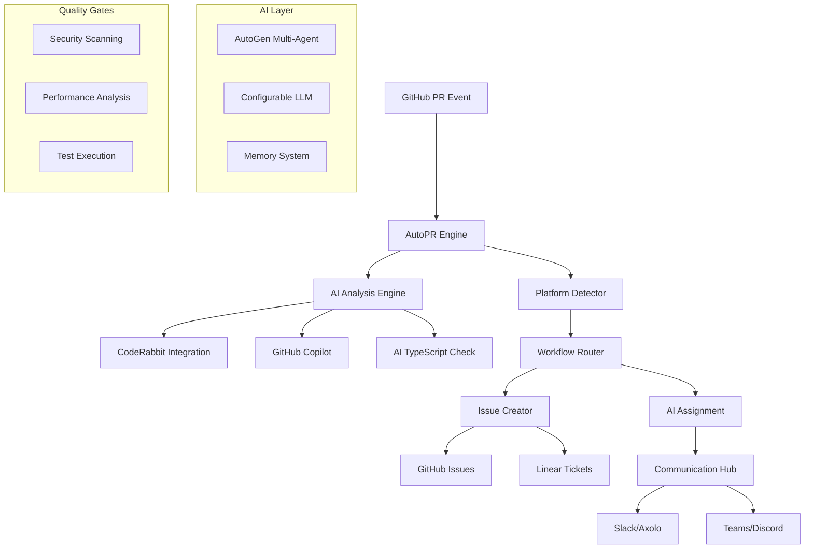

# AutoPR Engine 🤖

**AI-Powered GitHub PR Automation and Issue Management**

[](https://badge.fury.io/py/autopr-engine)>
[](https://www.python.org/downloads/)>
[](https://opensource.org/licenses/MIT)>
[](https://github.com/marketplace/autopr-engine)>

AutoPR Engine is a comprehensive AI-powered automation platform that transforms GitHub pull request
workflows through intelligent analysis, issue creation, and multi-agent collaboration.

> **📢 Repository Structure Update**: The repository has been reorganized for better maintainability
> and developer experience. See [Implementation Summary](docs/plans/IMPLEMENTATION_SUMMARY.md) for
> details on the improvements.

---

## 📁 **Repository Structure**

The AutoPR Engine repository is organized for optimal developer experience and maintainability:

```
autopr-engine/
├── docs/                      # 📚 All documentation
│   ├── getting-started/       # Setup and quick start guides
│   ├── development/           # Development guides and tools
│   ├── plans/                 # Project planning documents
│   └── README.md              # Documentation index
├── configs/                   # ⚙️ Configuration files
│   ├── environments/          # Environment-specific configs
│   ├── platforms/             # Platform configurations
│   └── workflows/             # Workflow configurations
├── templates/                 # 🎨 Template system
│   ├── platforms/             # Platform-specific templates
│   ├── use-cases/             # Use case templates
│   └── deployment/            # Deployment templates
├── tools/                     # 🔧 Development tools
├── build-artifacts/           # 📦 Build outputs
└── autopr/                    # 🚀 Main source code
```

---

## 🌟 **Features**

### **🤖 AI-Powered PR Analysis**

- **Multi-Agent Review**: CodeRabbit, GitHub Copilot, AI TypeScript Check integration
- **Platform Detection**: Detects 25+ development platforms (Replit, Bolt, Lovable, etc.)
- **Intelligent Issue Classification**: Security, performance, bugs, features
- **Quality Gates**: Automated validation before merge

### **🔗 Smart Integrations**

- **Communication**: Slack (Axolo), Microsoft Teams, Discord, Notion
- **Project Management**: Linear, GitHub Issues, Jira
- **AI Tools**: AutoGen multi-agent, configurable LLM providers
- **Monitoring**: Sentry, DataDog, Prometheus metrics

### **⚡ Advanced Automation**

- **Issue Auto-Creation**: GitHub Issues and Linear tickets
- **AI Tool Assignment**: Route issues to specialized AI tools
- **Workflow Orchestration**: 20+ pre-built workflows
- **Memory System**: Learn from past interactions and patterns

---

## 🚀 **Quick Start**

### **Installation**

```bash
# Install from PyPI
pip install autopr-engine

# Or install with all features
pip install "autopr-engine[full]"

# Docker deployment
docker run -d \
  -e GITHUB_TOKEN=your_token \
  -e OPENAI_API_KEY=your_key \
  -p 8080:8080 \
  neuralliquid/autopr-engine:latest
```

### **Basic Configuration**

```python
# autopr_config.py
from autopr import AutoPREngine

# Initialize engine
engine = AutoPREngine({
    'github_token': 'your_github_token',
    'openai_api_key': 'your_openai_key',
    'repositories': ['owner/repo'],
    'integrations': {
        'slack': {
            'webhook_url': 'your_slack_webhook',
            'channel': '#pr-reviews'
        },
        'linear': {
            'api_key': 'your_linear_key',
            'team_id': 'your_team_id'
        }
    }
})

# Start processing
await engine.start()
```

### **GitHub Action Integration**

```yaml
# .github/workflows/autopr.yml
name: AutoPR Analysis
on:
  pull_request:
    types: [opened, synchronize]

jobs:
  autopr:
    runs-on: ubuntu-latest
    steps:
      - uses: actions/checkout@v4
      - uses: neuralliquid/autopr-engine@v1
        with:
          github-token: ${{ secrets.GITHUB_TOKEN }}
          openai-api-key: ${{ secrets.OPENAI_API_KEY }}
          linear-api-key: ${{ secrets.LINEAR_API_KEY }}
```

---

## 📖 **Documentation**

### **Core Concepts**

- [**Architecture Overview**](docs/architecture.md) - System design and components
- [**Workflow Guide**](docs/workflows.md) - Creating and customizing workflows
- [**Action Reference**](docs/actions.md) - Complete action documentation
- [**Integration Guide**](docs/integrations.md) - Setting up external services

### **Platform-Specific Guides**

- [**Replit Integration**](docs/platforms/replit.md) - Prototype to production
- [**Slack/Axolo Setup**](docs/integrations/axolo.md) - PR channel automation
- [**Linear Workflow**](docs/integrations/linear.md) - Issue management
- [**Azure Deployment**](docs/deployment/azure.md) - Cloud deployment guide

### **Advanced Topics**

- [**Multi-Agent AI**](docs/advanced/autogen.md) - AutoGen integration
- [**Memory Systems**](docs/advanced/memory.md) - Learning and patterns
- [**Custom Actions**](docs/advanced/custom-actions.md) - Building your own
- [**Monitoring**](docs/advanced/monitoring.md) - Observability setup

---

## 🏗️ **Architecture**



---

## 🛠️ **Development**

### **Setup Development Environment**

```bash
# Clone repository
git clone https://github.com/neuralliquid/autopr-engine.git
cd autopr-engine

# Create virtual environment
python -m venv venv
source venv/bin/activate  # On Windows: venv\Scripts\activate

# Install in development mode
pip install -e ".[dev]"

# Run tests
pytest

# Run with live reload
python -m autopr.server --reload
```

### **Project Structure**

```text
autopr-engine/
├── autopr/                 # Core engine package
│   ├── actions/            # 50+ automation actions
│   ├── workflows/          # Pre-built workflow definitions
│   ├── integrations/       # External service integrations
│   ├── ai/                 # AI and LLM components
│   ├── memory/             # Learning and memory systems
│   ├── quality/            # Quality gates and validation
│   └── server/             # Web server and API
├── tests/                  # Comprehensive test suite
├── docs/                   # Documentation
├── docker/                 # Container definitions
├── scripts/                # Utility scripts
├── examples/               # Usage examples
├── requirements.txt        # Production dependencies
├── requirements-dev.txt    # Development dependencies
├── setup.py               # Package configuration
├── pyproject.toml         # Modern Python packaging
├── Dockerfile             # Container build
├── docker-compose.yml     # Local development
└── README.md              # This file
```

### **Testing**

```bash
# Run all tests
pytest

# Run with coverage
pytest --cov=autopr --cov-report=html

# Run specific test categories
pytest tests/actions/      # Action tests
pytest tests/workflows/    # Workflow tests
pytest tests/integration/  # Integration tests

# Run performance tests
pytest tests/performance/ -v
```

---

## 🔧 **Configuration**

### **Environment Variables**

```bash
# Core Configuration
GITHUB_TOKEN=ghp_xxxxxxxxxxxx           # GitHub API token
OPENAI_API_KEY=sk-xxxxxxxx              # OpenAI API key
AUTOPR_LOG_LEVEL=INFO                   # Logging level

# Optional AI Providers
ANTHROPIC_API_KEY=sk-ant-xxxxxxxx       # Claude API key
MISTRAL_API_KEY=xxxxxxxx                # Mistral API key
GROQ_API_KEY=gsk_xxxxxxxx               # Groq API key

# Integrations
SLACK_WEBHOOK_URL=https://hooks.slack.com/...  # Slack notifications
LINEAR_API_KEY=lin_api_xxxxxxxx         # Linear integration
AXOLO_WORKSPACE_URL=https://...         # Axolo integration

# Infrastructure
REDIS_URL=redis://localhost:6379        # Caching and state
DATABASE_URL=postgresql://...           # PostgreSQL database
SENTRY_DSN=https://...                  # Error tracking
```

### **Configuration File**

```yaml
# autopr.yml
repositories:
  - owner: neuralliquid
    repos: ["vv-landing", "vv-backend"]

workflows:
  - name: "pr_review_analysis"
    triggers: ["pull_request.opened", "pull_request.synchronize"]
    actions:
      - platform_detector
      - ai_analysis
      - issue_creator
      - team_notification

integrations:
  slack:
    enabled: true
    channels:
      pr_reviews: "#pr-reviews"
      security_alerts: "#security"

  linear:
    enabled: true
    team_id: "VV"
    project_templates:
      security: "Security Issues"
      performance: "Performance Optimization"

ai_providers:
  default: "openai"
  fallback_order: ["openai", "anthropic", "mistral"]
  models:
    openai: "gpt-4"
    anthropic: "claude-3-sonnet-20240229"
```

---

## 🔌 **Integrations**

### **Communication Platforms**

- **[Slack](docs/integrations/slack.md)** - Channel automation with Axolo
- **[Microsoft Teams](docs/integrations/teams.md)** - Enterprise communication
- **[Discord](docs/integrations/discord.md)** - Community-focused teams
- **[Notion](docs/integrations/notion.md)** - Documentation automation

### **Project Management**

- **[Linear](docs/integrations/linear.md)** - Modern issue tracking
- **[GitHub Issues](docs/integrations/github.md)** - Native GitHub integration
- **[Jira](docs/integrations/jira.md)** - Enterprise project management

### **AI & Development Tools**

- **[CodeRabbit](docs/integrations/coderabbit.md)** - AI code review
- **[GitHub Copilot](docs/integrations/copilot.md)** - AI coding assistant
- **[AutoGen](docs/integrations/autogen.md)** - Multi-agent collaboration
- **[Platform Detection](docs/features/platform-detection.md)** - 25+ platforms

---

## 📊 **Monitoring & Observability**

### **Built-in Metrics**

- PR processing times and success rates
- AI tool performance and accuracy
- Issue creation and resolution tracking
- Integration health monitoring

### **Supported Monitoring**

- **Prometheus** metrics collection
- **Grafana** dashboards
- **Sentry** error tracking
- **DataDog** APM integration
- **Custom webhooks** for external systems

---

## 🤝 **Contributing**

We welcome contributions! Please see our [Contributing Guide](CONTRIBUTING.md) for details.

### **Development Workflow**

1. Fork the repository
2. Create a feature branch (`git checkout -b feature/amazing-feature`)
3. Make your changes
4. Add tests for new functionality
5. Run the test suite (`pytest`)
6. Commit your changes (`git commit -m 'Add amazing feature'`)
7. Push to the branch (`git push origin feature/amazing-feature`)
8. Open a Pull Request

### **Code Standards**

- Follow [PEP 8](<https://peps.python.org/pep-0008/)> style guidelines
- Add type hints for all functions
- Write comprehensive tests for new features
- Update documentation for user-facing changes

---

## 📝 **License**

This project is licensed under the MIT License - see the [LICENSE](LICENSE) file for details.

---

## 🙏 **Acknowledgments**

- **AutoGen** team for multi-agent AI framework
- **CodeRabbit** for AI code review integration
- **Axolo** team for Slack PR automation
- **GitHub** for the platform and APIs
- **OpenAI** and **Anthropic** for AI capabilities
- All our **contributors** and **community members**

---

## 📞 **Support**

- **Documentation**: [https://autopr-engine.readthedocs.io](<https://autopr-engine.readthedocs.io)>
- **GitHub Issues**: [Report bugs and request
  features](<https://github.com/neuralliquid/autopr-engine/issues)>
- **Discussions**: [Community
  discussions](<https://github.com/neuralliquid/autopr-engine/discussions)>
- **Email**: [support@neuralliquid.com](mailto:support@neuralliquid.com)

---

**Made with ❤️ by the NeuralLiquid team**
