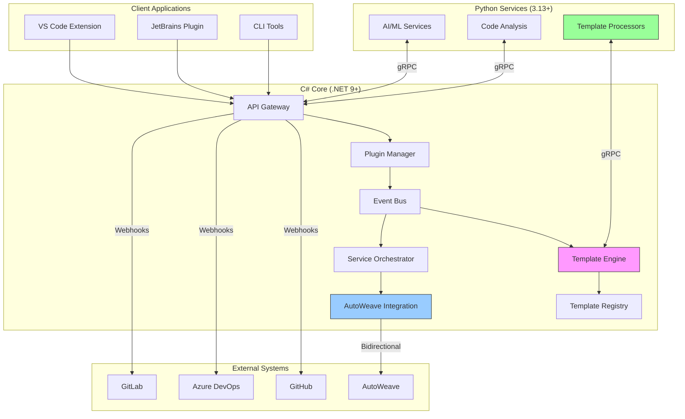

# AutoPR Architecture

## Overview

AutoPR is built on a hybrid architecture that leverages the strengths of both C# and Python, connected via gRPC for
high-performance inter-process communication. The system is designed with modularity, scalability, and maintainability as core principles, with a strong focus on extensibility through plugins and templates.

## AutoWeave: The Templating Engine

### Role in AutoPR

AutoWeave serves as the intelligent templating engine within AutoPR, providing a unified system for template
management, processing, and rendering across the platform. It handles:

- **Template Definition**: Structured YAML/JSON-based template definitions with support for variables, conditions, and loops
- **Multi-Format Support**: Generation of various output formats (YAML, JSON, HCL, etc.) from a single template
- **AI-Powered Enhancements**: Intelligent template suggestions and auto-completion using machine learning
- **Version Control Integration**: Git-based versioning and change tracking for all templates
- **Dependency Management**: Automatic resolution and management of template dependencies

### Future as a Standalone Product

While currently integrated with AutoPR, AutoWeave is being developed as a standalone product with these key goals:

1. **Independent Deployment**: Can be used independently of AutoPR for template management needs
2. **Broader Ecosystem Support**: Native integrations with CI/CD tools, IDEs, and other developer tools
3. **Template Marketplace**: A central repository for sharing and discovering community templates
4. **Enterprise Features**: RBAC, audit logging, and compliance tooling

### Package Ownership

- **Core Engine**: `@autoweave/template-engine` (TypeScript/Node.js)
- **SDK**: `@autoweave/template-sdk` (TypeScript/Node.js)
- **CLI**: `@autoweave/autoweave-cli` (TypeScript/Node.js)
- **VS Code Extension**: `autopr.autoweave-vscode`

### Dependencies

AutoWeave maintains a clear dependency boundary:

- **Internal Dependencies**: None - designed to be self-contained
- **External Dependencies**:
  - `handlebars` - Template rendering
  - `yaml` - YAML parsing and serialization
  - `ajv` - JSON Schema validation
  - `openai` - AI-powered template suggestions

## System Architecture

### Package Relationships

```mermaid
graph TD
    %% Core Packages
    A[AutoPR.Core] --> B[AutoPR.Plugins]
    A --> C[AutoPR.Extensions]
    A --> D[AutoPR.TemplateEngine]
    A --> E[AutoPR.Integration]

    %% Language Runtimes
    B --> F[AutoPR.Python]
    B --> G[AutoPR.Node]

    %% Client Libraries
    A --> H[@autopr/client]
    A --> I[AutoPR.Client]

    %% Plugin Packages
    B --> J[@autopr/plugin-github]
    B --> K[@autopr/plugin-azure]
    B --> L[@autopr/plugin-gitlab]
    B --> M[@autopr/plugin-autoweave]

    %% Template System
    D --> N[@autoweave/template-engine]
    D --> O[@autoweave/template-sdk]
    D --> P[@autoweave/template-registry]

    %% AI/ML Services
    F --> Q[AutoPR.AI.Core]
    Q --> R[AutoPR.AI.Training]
    Q --> S[AutoPR.AI.Evaluators]

    %% IDE Integrations
    E --> T[@autopr/plugin-vscode]
    E --> U[@autopr/plugin-jetbrains]

    %% Styling
    classDef core fill:#f9f,stroke:#333
    classDef plugin fill:#9cf,stroke:#333
    classDef template fill:#9f9,stroke:#333
    classDef ai fill:#f99,stroke:#333

    class A,B,C,D,E core
    class F,G,J,K,L,M plugin
    class N,O,P template
    class Q,R,S ai

    linkStyle 0,1,2,3 stroke:#333,stroke-width:2px
    linkStyle 4,5,6,7,8,9,10,11,12 stroke:#999,stroke-width:1px,stroke-dasharray: 5 5
```

### High-Level Components



## Core Architectural Decisions

### 1. Hybrid C#/Python Architecture
- **C# (.NET 9+)** for high-performance core services
  - API Gateway and request routing
  - Plugin management and lifecycle
  - Template processing orchestration
  - Event-driven architecture
- **Python (3.13+)** for AI/ML and data processing
  - Natural language processing
  - Code analysis and transformation
  - Template content generation
  - Machine learning model serving
- **gRPC** for cross-language communication
  - High-performance service communication
  - Strongly-typed contracts
  - Bidirectional streaming support

### 2. Plugin System
- Dynamic plugin loading and management
  - Hot-loading of plugins without restart
  - Dependency resolution and versioning
  - Resource isolation and sandboxing
- Versioned plugin API
  - Backward compatibility guarantees
  - Deprecation policies
  - Automatic updates
- Isolated execution environments
  - Process isolation for stability
  - Resource constraints and quotas
  - Security boundaries
- Lifecycle management
  - Startup and shutdown hooks
  - Health monitoring
  - Crash recovery

### 3. Template Engine
- **Template Processing**
  - Multi-stage template rendering pipeline
  - Support for multiple template languages (Liquid, Handlebars, etc.)
  - Caching and incremental updates
  - Dependency tracking and invalidation
- **Template Registry**
  - Centralized template storage
  - Versioning and semantic versioning support
  - Template metadata and documentation
  - Access control and permissions
- **Template Development**
  - Local development workflow
  - Testing and validation framework
  - Template packaging and distribution
  - Documentation generation

### 4. AutoWeave Integration
- **Bidirectional Communication**
  - Real-time synchronization with AutoWeave
  - Event-driven architecture integration
  - Webhook support for external triggers
- **Data Flow**
  - Template and asset synchronization
  - Configuration management
  - Status reporting and monitoring
- **Security**
  - OAuth2 authentication
  - Role-based access control
  - Audit logging and compliance

### 5. Event-Driven Architecture
- Asynchronous event processing
  - High-throughput message processing
  - Backpressure handling
  - Dead letter queues for failed messages
- Durable event store
  - Event sourcing for critical workflows
  - Event replay capabilities
  - Compaction and retention policies
- Support for multiple event bus implementations
  - In-memory for development
  - Distributed (Kafka, Azure Event Hubs, etc.) for production
  - Pluggable storage backends

### 4. API Design
- RESTful API for external consumers
- gRPC for internal service communication
- Versioned API endpoints
- Comprehensive API documentation using OpenAPI/Swagger

### 5. Data Persistence
- Primary database: PostgreSQL for structured data
- Redis for caching and pub/sub
- Blob storage for large assets
- Data encryption at rest and in transit

### 6. Security
- OAuth 2.0 and OpenID Connect for authentication
- Role-Based Access Control (RBAC)
- Attribute-Based Access Control (ABAC)
- Comprehensive audit logging
- Regular security audits and penetration testing

### 7. Monitoring & Observability
- Distributed tracing with OpenTelemetry
- Metrics collection with Prometheus
- Structured logging with Serilog
- Alerting and dashboards with Grafana

## Deployment Architecture

### Containerization
- Docker containers for all services
- Kubernetes for orchestration
- Helm charts for deployment
- Service mesh for service-to-service communication

### CI/CD
- Automated testing and validation
- Blue/Green deployments
- Canary releases
- Infrastructure as Code (Terraform)

## Performance Considerations
- Caching strategy with Redis
- Database query optimization
- Asynchronous processing for long-running tasks
- Horizontal scaling of stateless services

## High Availability
- Multi-region deployment
- Automated failover
- Data replication
- Load balancing

## Future Extensibility
- Support for additional VCS providers
- Expanded plugin capabilities
- Enhanced AI/ML features
- Serverless function support

## Compliance & Standards
- GDPR compliance
- SOC 2 Type II certification
- Regular security audits
- Compliance as code

## Related Documents
- [Architecture Decision Records (ADRs)](./adr/)
- [Deployment Guide](./deployment.md)
- [Developer Guide](./DEVELOPER.md)
- [API Documentation](./api/)

## Getting Started
See the [Quick Start Guide](./QUICKSTART.md) for instructions on setting up a development environment and running AutoPR locally.
