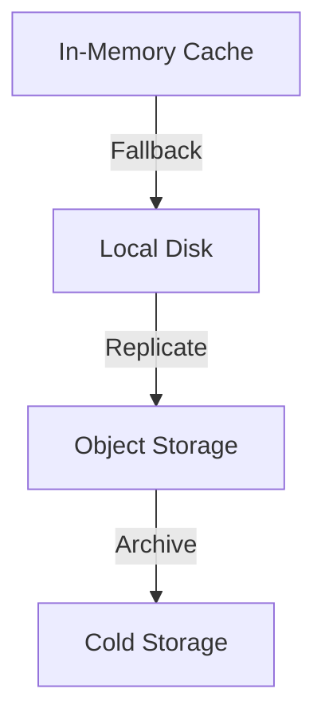

# 11. Data Persistence Strategy

## Status
Proposed

## Context
AutoPR requires reliable data storage for:
- Repository configurations
- User preferences
- Execution history
- Cached analysis results
- Plugin data

## Decision
We will implement a layered persistence strategy with the following components:

### 1. Storage Tiers


### 2. Data Access Layer
```typescript
interface DataStore<T> {
  get(id: string): Promise<T | null>;
  set(id: string, data: T): Promise<void>;
  delete(id: string): Promise<void>;
  query(filter: Partial<T>): Promise<T[]>;
  exists(id: string): Promise<boolean>;
}
```

### 3. Implementation Details

#### 3.1 Local Development
- **SQLite** for structured data
- **JSON files** for configurations
- **In-memory cache** with TTL

#### 3.2 Production
- **PostgreSQL** for transactional data
- **Redis** for caching and pub/sub
- **S3-compatible storage** for large blobs

#### 3.3 Data Models
```typescript
interface RepositoryConfig {
  id: string;
  name: string;
  settings: {
    autoMerge: boolean;
    requiredChecks: string[];
    branchProtection: BranchProtectionRules;
  };
  createdAt: Date;
  updatedAt: Date;
}

interface ExecutionLog {
  id: string;
  repositoryId: string;
  action: string;
  status: 'pending' | 'running' | 'completed' | 'failed';
  startedAt: Date;
  completedAt?: Date;
  metadata: Record<string, unknown>;
  error?: {
    message: string;
    stack?: string;
    code?: string;
  };
}
```

### 4. Migration Strategy
1. **Versioned Migrations**
   ```bash
   # Example migration file: 20230101000000_initial_schema.sql
   CREATE TABLE IF NOT EXISTS repositories (
     id TEXT PRIMARY KEY,
     name TEXT NOT NULL,
     settings JSONB NOT NULL,
     created_at TIMESTAMP WITH TIME ZONE NOT NULL,
     updated_at TIMESTAMP WITH TIME ZONE NOT NULL
   );
   ```

2. **Rollback Plan**
    - Automated backups before migrations
    - Blue/green deployment support
    - Point-in-time recovery

## Consequences
### Positive
- Data durability
- Performance optimization
- Scalability
- Disaster recovery

### Negative
- Storage costs
- Operational complexity
- Learning curve

### Neutral
- Backup strategy required
- Monitoring needs

## Related Decisions
- [ADR-0009: Error Handling Strategy](0009-error-handling-strategy.md)
- [ADR-0010: Monitoring and Observability](0010-monitoring-observability.md)
- [ADR-0012: Deployment Strategy](0012-deployment-strategy.md)
