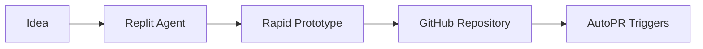
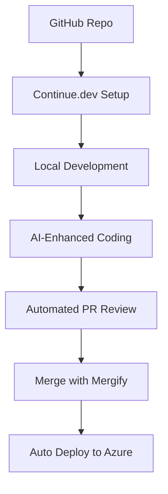
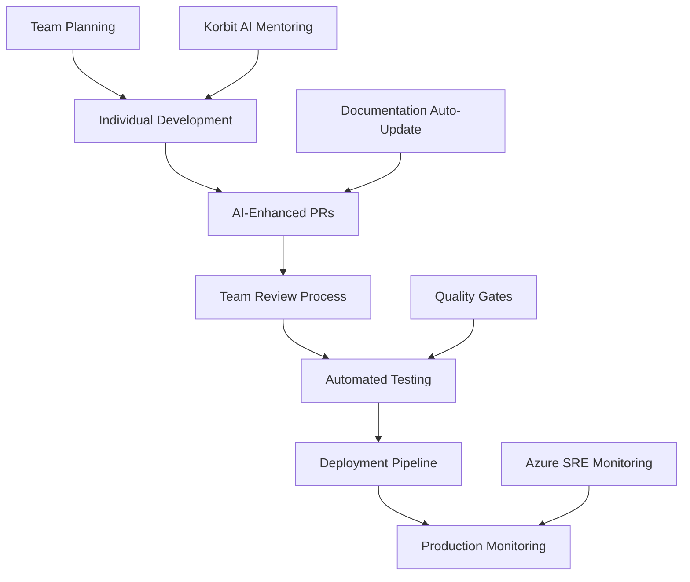

# Implementation Roadmap & Typical Workflows

## 🗺️ Your Personal AI Development Journey

A step-by-step roadmap for transforming your development workflow with AI tools, including typical project workflows
and practical implementation schedules.

---

## 🚀 **30-60-90 Day Implementation Plan**

### **Days 1-7: Foundation Setup**

#### **Week 1 Core Tools** ⭐⭐⭐⭐⭐ *Essential*

``` text
Day 1-2: Basic Infrastructure
✅ Continue.dev - FREE AI coding assistant
✅ Aider - FREE autonomous coding
✅ Renovate - FREE dependency management
✅ AI TypeScript Check - FREE TypeScript validation

Day 3-4: Code Review Foundation✅ CodeRabbit AI - $12/month (essential for PR reviews)
✅ CharlieHelps - Design partner program (if TypeScript-heavy)

Day 5-7: Azure & Monitoring
✅ Azure SRE Agent - FREE with Azure subscription
✅ Azure Copilot - FREE with Azure subscription
✅ GitHub Actions - FREE tier (sufficient for most projects)

Total Week 1 Cost: $12-50/month
Expected Impact: 40% faster development, 60% better code quality

```text

### **Days 8-30: Enhanced Automation**

#### **Week 2-4 Expansion** ⭐⭐⭐⭐ *High Impact*

``` text
Week 2: PR & Merge Automation
✅ Mergify - $8/repo/month for smart PR automation
✅ GitHub Copilot - $10/month for code completion
✅ Replit Agent - FREE tier for rapid prototyping

Week 3: Testing & Quality
✅ Testim.io - $450/month for E2E automation
✅ SonarCloud - $10/dev/month for quality gates
✅ Snyk - $25/dev/month for security scanning

Week 4: Documentation & Monitoring
✅ Mintlify Writer - $20/month for technical docs
✅ New Relic AI - $99/month for performance monitoring
✅ Promptless - Custom pricing for doc automation

Total Month 1 Cost: $200-400/month
Expected Impact: 60% faster delivery, 80% fewer bugs
```

### **Days 31-60: Advanced Integration**

#### **Month 2: Specialization** ⭐⭐⭐⭐ *Team Optimization*

``` text
Week 5-6: Advanced AI Tools
✅ Korbit AI - Custom enterprise pricing
✅ Cursor - $20/month for advanced IDE AI
✅ Windsurf (Codeium) - $12/month for fill-in-the-middle
✅ Tabnine Pro - $12/month for custom model training

Week 7-8: Infrastructure & Deployment
✅ Terraform Cloud - $20/user/month for IaC
✅ Octopus Deploy - Enterprise deployment automation
✅ DataDog AI - $15/host/month for infrastructure monitoring
✅ Azure DevOps AI - $6/user/month for pipeline optimization

Total Month 2 Cost: $300-800/month
Expected Impact: 70% faster deployment, 90% automated workflows

```text

### **Days 61-90: Enterprise Features**

#### **Month 3: Full Automation** ⭐⭐⭐⭐⭐ *Maximum Efficiency*

``` text
Week 9-10: Custom Integrations
✅ AutoPR workflows - Custom Python actions
✅ Multi-agent systems (AutoGen/CrewAI)
✅ Advanced memory systems (Mem0)
✅ Custom LLM configurations

Week 11-12: Compliance & Scale
✅ Enterprise security tools
✅ Compliance automation
✅ Team analytics and reporting
✅ Custom workflow optimizations

Total Month 3 Cost: $500-1500/month
Expected Impact: 80% automation, 3x productivity improvement
```

---

## 🔄 **Typical Project Workflows**

### **Workflow 1: Rapid Prototyping → Production**

#### **Phase 1: Replit Prototyping**



**Tools & Process:**

1. **Start in Replit** - Use Replit Agent for rapid prototyping
    - Natural language → working code in minutes
    - Built-in AI pair programming
    - Instant deployment for testing

1. **GitHub Migration** - Move to GitHub when ready
    - Export from Replit to GitHub repository
    - Automatic README and documentation generation
    - Initial CI/CD setup with GitHub Actions

1. **AutoPR Activation** - Triggers on first push/PR
    - Automatic code review with CodeRabbit
    - Security scanning with Snyk
    - Quality gates with SonarCloud
    - Documentation updates with Promptless

**Timeline**: Idea → Working prototype: 2-4 hours
**Cost**: $0 (Replit free tier) → $50/month (basic tools)

#### **Phase 2: Development Enhancement**



**Enhanced Development Loop:**

1. **Local AI Development**
    - Continue.dev for AI pair programming
    - Aider for autonomous code generation
    - Cursor for advanced IDE features

1. **Automated PR Process**
    - CharlieHelps for TypeScript-specific reviews
    - CodeRabbit for comprehensive analysis
    - AI TypeScript Check for validation
    - Automatic fixes applied via AI

1. **Smart Merging & Deployment**
    - Mergify handles merge queue management
    - AutoPR workflows for custom automation
    - Azure SRE Agent monitors deployments
    - Automatic rollback if issues detected

### **Workflow 2: Enterprise Team Development**

#### **Multi-Developer Coordination**



**Team Process:**

1. **Sprint Planning** - PRD generation with enhanced ChatPRD stack
2. **Development** - Each developer uses AI coding assistants
3. **Code Review** - Multi-layer AI review (CodeRabbit + Korbit + CharlieHelps)
4. **Testing** - Automated E2E with Testim.io + security with Snyk
5. **Deployment** - Azure-native deployment with monitoring
6. **Learning** - Korbit AI provides team mentoring and insights

### **Workflow 3: Open Source → Enterprise Transition**

#### **Scaling Strategy**

``` text
Phase 1: Open Source Tools (FREE)
├── Continue.dev for AI assistance
├── Aider for autonomous coding├── Renovate for dependencies
├── SonarCloud (free for public repos)
└── GitHub Actions (free tier)

Phase 2: Professional Tools ($200-500/month)
├── CodeRabbit for advanced review
├── CharlieHelps for TypeScript expertise
├── Testim.io for E2E testing
├── New Relic for monitoring
└── Snyk for security

Phase 3: Enterprise Scale ($1000+/month)
├── Korbit AI for team mentoring
├── Enterprise security tools
├── Custom AutoPR workflows
├── Advanced analytics
└── Compliance automation

```text

---

## 📅 **Weekly Implementation Schedule**

### **Week 1: Getting Started**

``` text
Monday: Setup Continue.dev + Aider
Tuesday: Install CodeRabbit on main repositories
Wednesday: Configure Renovate for dependency updates
Thursday: Setup AI TypeScript Check in CI/CD
Friday: Team training session + workflow documentation
Weekend: Monitor usage and gather initial feedback
```

### **Week 2: PR Automation**

``` text
Monday: Install and configure Mergify rules
Tuesday: Setup GitHub Copilot for team
Wednesday: Configure AutoPR basic workflows
Thursday: Integrate Replit for rapid prototyping
Friday: Optimize PR review process
Weekend: Analyze PR review time improvements

```text

### **Week 3: Quality & Testing**

``` text
Monday: Setup Testim.io for E2E testing
Tuesday: Configure SonarCloud quality gates
Wednesday: Install Snyk security scanning
Thursday: Setup performance monitoring
Friday: Review quality metrics and adjust
Weekend: Plan documentation automation
```

### **Week 4: Documentation & Monitoring**

``` text
Monday: Setup Mintlify for technical documentation
Tuesday: Configure Promptless for auto-updates
Wednesday: Setup comprehensive monitoring
Thursday: Configure team analytics
Friday: Month 1 review and optimization
Weekend: Plan Month 2 advanced features

```text

---

## 🛠️ **Tool-Specific Implementation Guides**

### **Replit Agent → GitHub Workflow**

#### **Setup Process:**

```bash

# 1. Create prototype in Replit

# Use natural language prompts with Replit Agent

"Create a TypeScript React app with user authentication"

# 2. Export to GitHub

# Use Replit's GitHub integration

git remote add origin <<<https://github.com/yourusername/your-repo.git>>>
git push -u origin main

# 3. Setup AutoPR triggers

# Add .github/workflows/autopr.yml

name: AutoPR Workflow
on: [push, pull_request]
jobs:
  autopr:
    runs-on: ubuntu-latest
    steps:

      - uses: actions/checkout@v3
      - name: Trigger AutoPR

        run: |
          # CodeRabbit review
          # Snyk security scan          # SonarCloud quality check
          # Automatic documentation update

```text

#### **Replit → Production Timeline:**

- **Hour 1**: Idea to working prototype in Replit
- **Hour 2**: Export to GitHub with basic CI/CD
- **Hour 3**: AutoPR setup and first automated review
- **Hour 4**: Deploy to Azure with monitoring

### **Continue.dev Advanced Setup**

#### **Custom Configuration:**

```json
{
  "models": [
    {
      "title": "Claude 3.5 Sonnet",
      "provider": "anthropic",
      "model": "claude-3-5-sonnet-20241022",
      "apiKey": "[ANTHROPIC_API_KEY]"
    },
    {
      "title": "GPT-4",
      "provider": "openai",      "model": "gpt-4",
      "apiKey": "[OPENAI_API_KEY]"
    }
  ],
  "customCommands": [
    {
      "name": "review",
      "prompt": "Review this code for TypeScript best practices and suggest improvements"
    },
    {
      "name": "test",
      "prompt": "Generate comprehensive tests for this function"
    }
  ],
  "contextProviders": [
    {
      "name": "codebase",
      "params": {
        "nRetrieve": 25,
        "nFinal": 5
      }
    }
  ]
}

```text

### **CharlieHelps Integration**

#### **Linear → GitHub Workflow:**

``` text
1. Create Linear ticket with requirements
2. Tag @charlie in Linear ticket
3. Charlie generates implementation plan
4. Charlie creates GitHub branch and PR
5. AutoPR workflows trigger on PR creation:
   ├── CodeRabbit review
   ├── AI TypeScript Check validation
   ├── Snyk security scan
   ├── SonarCloud quality analysis
   └── Testim.io E2E tests
6. Mergify handles merge when all checks pass
7. Azure SRE Agent monitors deployment
```

---

## 📊 **Progress Tracking & Metrics**

### **Weekly KPIs to Monitor**

#### **Development Velocity**

``` text
Week 1 Baseline:
├── PR Review Time: [Record current average]
├── Bug Detection Rate: [Record current rate]├── Deployment Frequency: [Record current frequency]
├── Feature Delivery Time: [Record current time]
└── Developer Satisfaction: [Survey baseline]

Week 2-4 Targets:
├── PR Review Time: 25% reduction
├── Bug Detection Rate: 50% improvement
├── Deployment Frequency: 2x increase├── Feature Delivery Time: 30% reduction
└── Developer Satisfaction: 20% improvement

```text

#### **Cost Efficiency Tracking**

```python

# Monthly ROI Calculator

def track_monthly_progress(month):
    costs = {
        1: 200,   # Month 1 tool costs
        2: 400,   # Month 2 tool costs        3: 800    # Month 3 tool costs
    }

    time_savings = {
        1: 0.30,  # 30% time savings
        2: 0.50,  # 50% time savings
        3: 0.70   # 70% time savings
    }

    team_cost = 5 * 75 * 160  # 5 devs * $75/hour * 160 hours
    savings = team_cost * time_savings[month]
    roi = ((savings - costs[month]) / costs[month]) * 100

    return {
        "month": month,
        "investment": costs[month],
        "savings": savings,
        "roi": roi,
        "payback_days": costs[month] / (savings / 30)
    }

```text

### **Success Milestones**

#### **30-Day Milestones**

- [ ] All core tools installed and configured
- [ ] Team adoption rate > 80%
- [ ] PR review time reduced by 25%
- [ ] Zero critical security vulnerabilities in new code
- [ ] Basic automation workflows operational

#### **60-Day Milestones**

- [ ] Advanced tools integrated and optimized
- [ ] Development velocity increased by 40%
- [ ] Bug detection rate improved by 3x
- [ ] Deployment automation > 90% success rate
- [ ] Team satisfaction improved by 30%

#### **90-Day Milestones**

- [ ] Full AI-enhanced development workflow
- [ ] 70% overall efficiency improvement
- [ ] ROI > 500% on tool investment
- [ ] Industry-leading code quality metrics
- [ ] Custom workflows and integrations operational

---

## 🎯 **Action Items for Next Week**

### **Immediate Actions (This Week)**

1. **Day 1**: Install Continue.dev and configure with your API keys
2. **Day 2**: Setup CodeRabbit on your main repositories
3. **Day 3**: Configure Renovate for automatic dependency updates
4. **Day 4**: Create Replit account and test prototype workflow
5. **Day 5**: Team training session and workflow documentation

### **Preparation for Week 2**

- [ ] Evaluate which repositories need Mergify automation
- [ ] Plan GitHub Copilot rollout for team members
- [ ] Design AutoPR workflows for your specific needs
- [ ] Schedule Testim.io demo and setup
- [ ] Prepare SonarCloud quality gate configurations

### **Long-term Planning**

- [ ] Budget approval for Month 2 tools ($400-800 range)
- [ ] Plan CharlieHelps integration with Linear workflow
- [ ] Design custom Azure deployment automation
- [ ] Evaluate enterprise tools for Month 3

---

## 🚀 **Quick Start Commands**

### **Get Started Today (30 minutes)**

```bash

# 1. Install Continue.dev

npm install -g continue

# 2. Install Aiderpip install aider-chat

# 3. Setup CodeRabbit (GitHub App)

# Visit: <<<https://github.com/apps/coderabbit-ai>>>

# 4. Configure Renovate

# Visit: <<<https://github.com/apps/renovate>>>

# 5. Start with Replit prototype

# Visit: <<<https://replit.com/ai>>>

```text

### **Test Your Setup**

```bash

# Test Continue.dev

continue --help

# Test Aider with a simple task

aider --message "Add TypeScript types to this JavaScript file"

# Verify GitHub integrations

gh api /user/installations  # Check installed apps

# Create test PR to verify AutoPR workflows

git checkout -b test-autopr
echo "// Test change" >> README.md
git add . && git commit -m "Test AutoPR workflow"
git push origin test-autopr
gh pr create --title "Test AutoPR" --body "Testing automated review"

```text

---

*This roadmap provides a clear, actionable path to transform your development workflow with AI tools. Start with the free tools, measure impact, and gradually scale to enterprise-level automation.*
