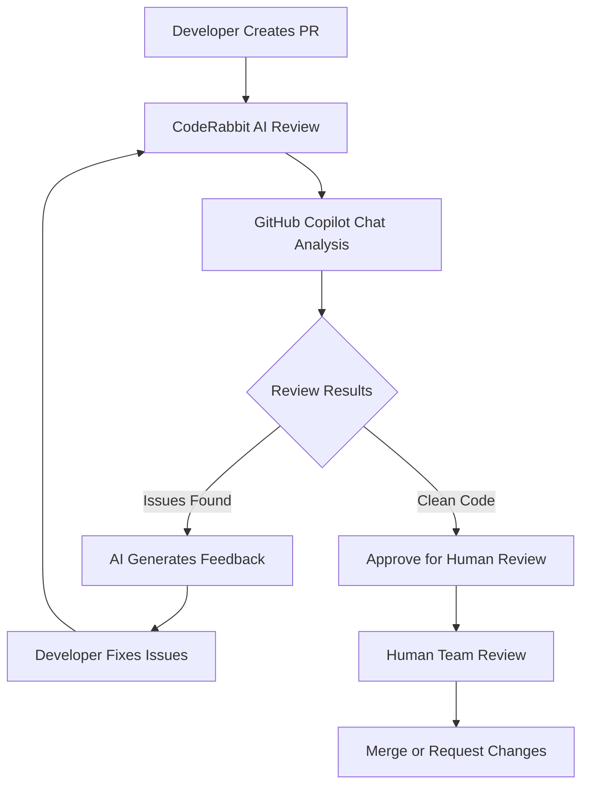
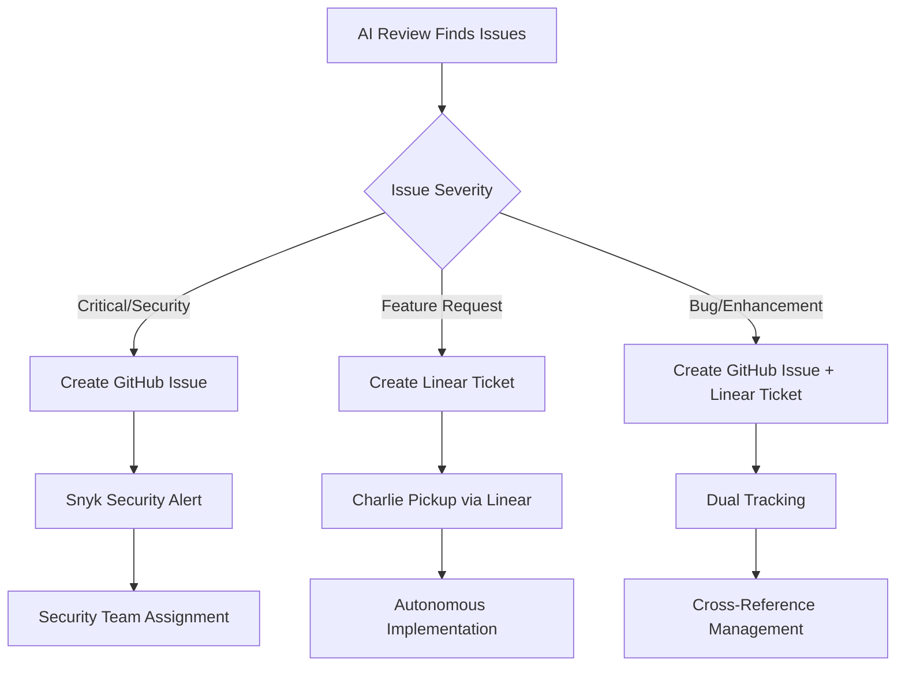
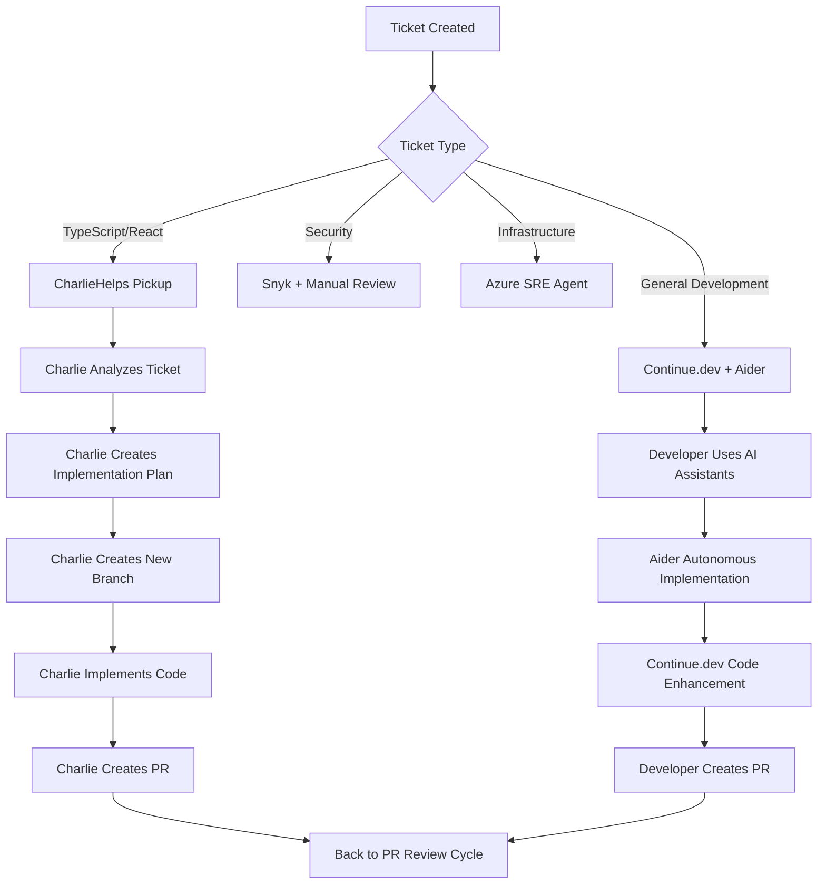
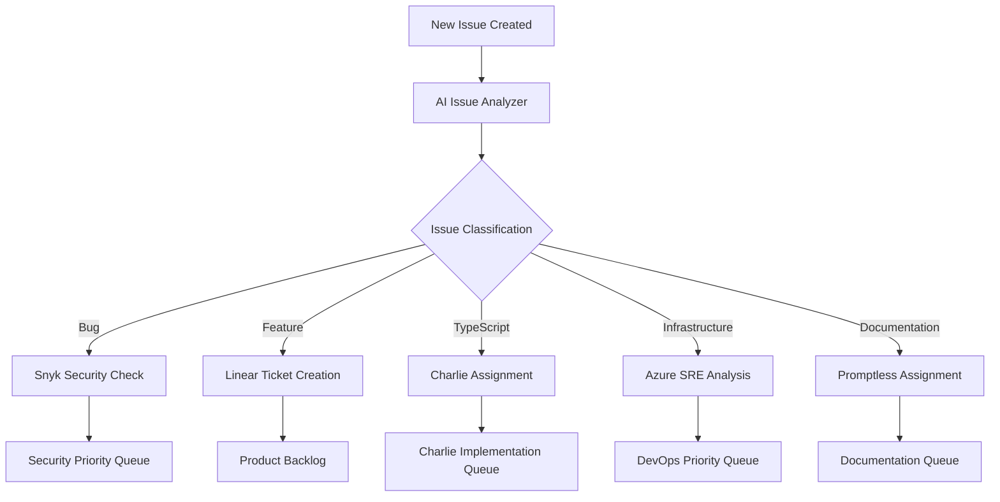
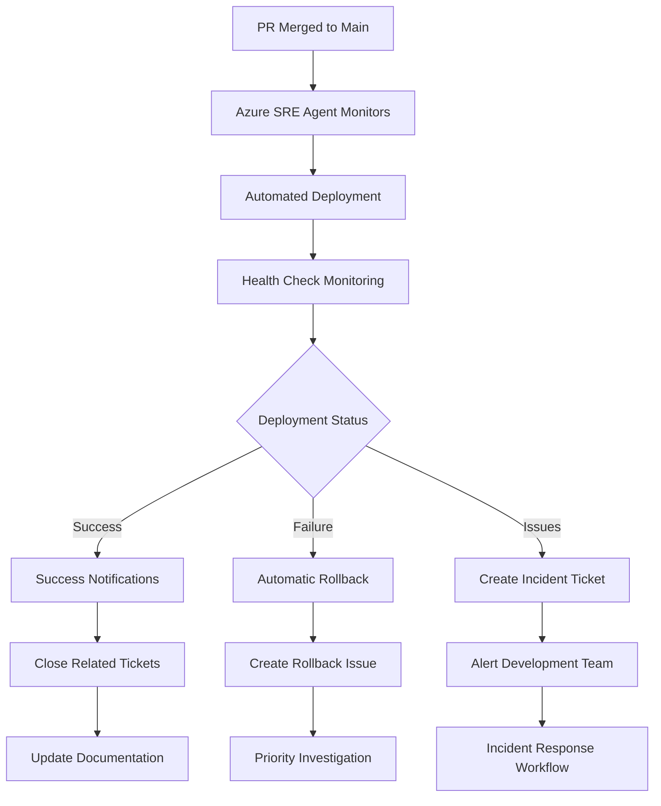
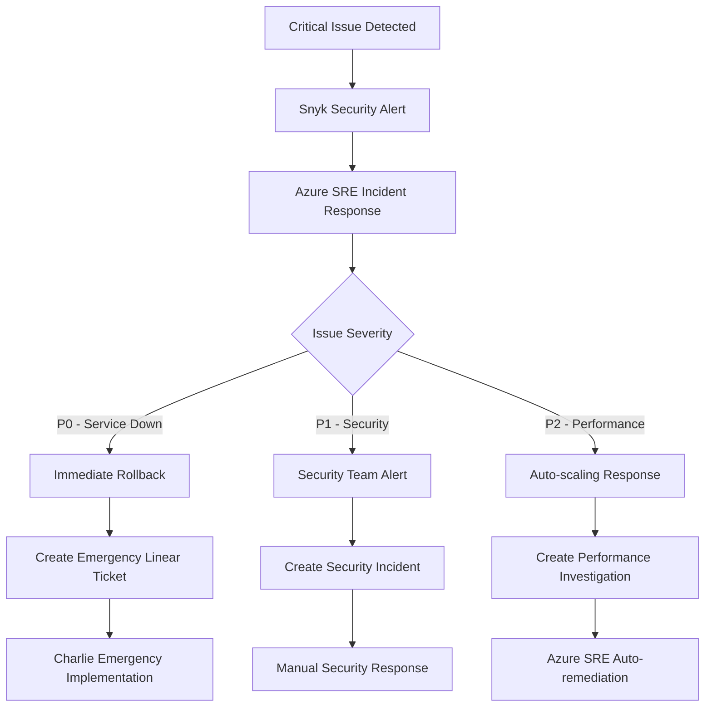

# Key AI Development Workflows

## 🔄 Complete Development Lifecycle with AI Automation

Detailed workflows showing how AI tools interact throughout the development process, from PR creation to ticket
resolution and deployment.

---

## 🎯 **Workflow 1: Pull Request Lifecycle**

### **Phase 1: PR Creation & Initial Review**



#### **Step 1: Automated AI Review (0-5 minutes)**

**Tools**: CodeRabbit AI + GitHub Copilot Chat + AI TypeScript Check

```yaml
# Triggered automatically on PR creation
on:
  pull_request:
    types: [opened, synchronize]

jobs:
  ai-review:
    runs-on: ubuntu-latest
    steps:
      # CodeRabbit reviews entire PR
      - name: CodeRabbit Analysis
        # Automatically triggered via GitHub App
        # Reviews: code quality, security, performance, best practices

      # GitHub Copilot Chat provides additional insights
      - name: Copilot Chat Review
        run: |
          gh copilot explain "${{ github.event.pull_request.diff_url }}"
          gh copilot suggest improvements

      # AI TypeScript Check validates types
      - name: TypeScript AI Validation
        run: |
          curl -X POST https://ts-check.okikio.dev/twoslash \
            -F "code=$(git diff HEAD~1 --name-only | grep -E '\.(ts|tsx)$' | xargs cat)" \
            -F "extension=ts"
```

#### **Step 2: Review Results Processing (5-10 minutes)**

**Decision Points**:

- ✅ **Clean PR**: Moves to human review
- ⚠️ **Minor Issues**: AI suggests quick fixes
- ❌ **Major Issues**: Creates detailed feedback + blocks merge

**AI Feedback Examples**:

```typescript
// CodeRabbit identifies performance issue
// Before:
const users = await Promise.all(
  userIds.map(id => fetchUser(id))
);

// CodeRabbit suggests:
// "Consider using batch fetching to reduce API calls"
const users = await fetchUsersBatch(userIds);
```

### **Phase 2: Issue Detection & Ticket Creation**



#### **Alternative Flow A: GitHub Issues (Bug Fixes & Enhancements)**

**Trigger**: CodeRabbit finds bugs or suggests enhancements

```python
# AutoPR Action: Create GitHub Issue from PR Review
class PRReviewIssueCreator:
    def create_issue_from_review(self, pr_review_data):
        """Creates GitHub issue from CodeRabbit review findings"""

        for finding in pr_review_data.findings:
            if finding.severity in ['high', 'critical']:
                issue = self.github.create_issue(
                    title=f"[AI Detected] {finding.type}: {finding.summary}",
                    body=f"""
                    **Detected by**: CodeRabbit AI Review
                    **PR**: #{pr_review_data.pr_number}
                    **File**: {finding.file_path}
                    **Line**: {finding.line_number}

                    ## Issue Description
                    {finding.description}

                    ## Suggested Fix
                    {finding.suggested_fix}

                    ## AI Confidence Score
                    {finding.confidence_score}/100
                    """,
                    labels=['ai-detected', finding.severity, finding.type],
                    assignees=['team-lead']  # Auto-assign based on file ownership
                )

                # Tag relevant AI for pickup
                if finding.type == 'typescript':
                    self.assign_to_charlie(issue)
                elif finding.type == 'security':
                    self.assign_to_snyk_workflow(issue)

        return created_issues

    def assign_to_charlie(self, issue):
        """CharlieHelps picks up TypeScript-related issues"""
        self.github.add_comment(
            issue.number,
            "@charlie please review and implement fix for this TypeScript issue"
        )
```

#### **Alternative Flow B: Linear Tickets (Feature Development)**

**Trigger**: CodeRabbit suggests feature improvements or refactoring

```typescript
// AutoPR Integration with Linear API
class LinearTicketCreator {
  async createFromPRReview(reviewData: PRReviewData) {
    const ticket = await this.linear.createIssue({
      title: `[AI Suggested] ${reviewData.suggestion.title}`,
      description: `
        **Source**: CodeRabbit AI Review
        **PR**: #${reviewData.prNumber}
        **Suggestion Type**: ${reviewData.suggestion.type}

        ## Current Implementation
        ${reviewData.currentCode}

        ## Suggested Improvement
        ${reviewData.suggestion.description}

        ## Expected Benefits
        - ${reviewData.suggestion.benefits.join('\n- ')}

        ## Implementation Estimate
        ${reviewData.suggestion.timeEstimate}
      `,
      labels: ['ai-suggested', 'enhancement'],
      priority: this.calculatePriority(reviewData.suggestion.impact),
      assignee: null  // Will be picked up by Charlie
    });

    // Notify Charlie via Linear
    await this.linear.addComment(ticket.id,
      "@charlie this ticket is ready for autonomous implementation"
    );

    return ticket;
  }
}
```

### **Phase 3: AI Pickup & Implementation**



#### **CharlieHelps Autonomous Implementation Flow**

```text
Linear Ticket → Charlie Analysis → Implementation → PR Creation

Step 1: Ticket Pickup (Automatic)
- Charlie monitors Linear for tagged tickets
- Analyzes ticket description and requirements
- Estimates implementation complexity
- Creates implementation plan

Step 2: Code Implementation (15-60 minutes)
- Creates new branch from main
- Implements TypeScript/React changes
- Adds proper types and interfaces
- Writes unit tests
- Updates documentation

Step 3: PR Creation (Automatic)
- Creates PR with detailed description
- Links back to original Linear ticket
- Adds appropriate labels and reviewers
- Triggers CI/CD pipeline

Example Charlie Implementation:
```

**Charlie Implementation Example**:

```typescript
// Original Linear Ticket: "Add user role validation to dashboard components"

// Charlie's Implementation:
interface UserRole {
  id: string;
  name: string;
  permissions: Permission[];
}

interface Permission {
  resource: string;
  actions: ('read' | 'write' | 'admin')[];
}

// Enhanced dashboard component with role validation
const DashboardComponent: React.FC<{user: User}> = ({user}) => {
  const hasPermission = useRoleValidation(user.roles);

  if (!hasPermission('dashboard', 'read')) {
    return <UnauthorizedComponent />;
  }

  return (
    <div className="dashboard">
      {hasPermission('analytics', 'read') && <AnalyticsSection />}
      {hasPermission('users', 'admin') && <UserManagementSection />}
    </div>
  );
};

// Charlie also adds tests
describe('DashboardComponent', () => {
  it('shows analytics for users with analytics read permission', () => {
    const user = createMockUser(['analytics:read']);
    render(<DashboardComponent user={user} />);
    expect(screen.getByTestId('analytics-section')).toBeInTheDocument();
  });
});
```

#### **Alternative AI Implementation Flows**

##### **Flow A: Continue.dev + Aider for General Development**

```bash
# Developer workflow with AI assistants
# 1. Pick up GitHub issue
gh issue view 123 --json title,body | aider --message "Implement the feature described in this issue"

# 2. Aider analyzes and implements
# - Understands requirements from issue description
# - Analyzes existing codebase for patterns
# - Implements feature across multiple files
# - Generates tests and documentation
# - Commits changes with descriptive message

# 3. Continue.dev for refinement
# Developer opens files in IDE
# Uses Continue.dev to refine implementation
# Adds additional context and edge cases
```

##### **Flow B: Multi-Agent Implementation (Advanced)**

```python
# CrewAI multi-agent implementation for complex features
from crewai import Agent, Task, Crew

# Define specialized agents
architect = Agent(
    role='Software Architect',
    goal='Design scalable solution architecture',
    tools=['codebase_analyzer', 'design_pattern_library']
)

implementer = Agent(
    role='Senior Developer',
    goal='Implement robust, tested code',
    tools=['code_generator', 'test_framework', 'documentation_generator']
)

reviewer = Agent(
    role='Code Reviewer',
    goal='Ensure code quality and best practices',
    tools=['static_analyzer', 'security_scanner', 'performance_profiler']
)

# Create implementation workflow
design_task = Task(
    description='Design authentication system architecture',
    agent=architect,
    expected_output='Technical design document with API specifications'
)

implement_task = Task(
    description='Implement authentication system based on design',
    agent=implementer,
    context=[design_task],
    expected_output='Complete implementation with tests'
)

review_task = Task(
    description='Review implementation for quality and security',
    agent=reviewer,
    context=[implement_task],
    expected_output='Code review report with improvement suggestions'
)

# Execute multi-agent implementation
crew = Crew(
    agents=[architect, implementer, reviewer],
    tasks=[design_task, implement_task, review_task],
    verbose=True
)

result = crew.kickoff()
```

---

## 🔄 **Workflow 2: Issue Triage & Assignment**

### **Automated Issue Classification**



#### **AI Issue Classifier Implementation**

```python
class AIIssueClassifier:
    def __init__(self):
        self.classification_rules = {
            'security': ['vulnerability', 'security', 'CVE', 'exploit', 'auth'],
            'typescript': ['typescript', 'type error', 'interface', 'generic'],
            'bug': ['error', 'broken', 'failing', 'crash', 'exception'],
            'feature': ['feature', 'enhancement', 'new', 'add', 'implement'],
            'documentation': ['docs', 'readme', 'documentation', 'guide'],
            'infrastructure': ['deployment', 'ci/cd', 'pipeline', 'azure', 'docker']
        }

    def classify_and_route(self, issue):
        """Classifies issue and routes to appropriate AI system"""
        classification = self.classify_issue(issue.title + " " + issue.body)

        routing_actions = {
            'security': self.route_to_security_workflow,
            'typescript': self.route_to_charlie,
            'bug': self.route_to_development_team,
            'feature': self.route_to_product_backlog,
            'documentation': self.route_to_documentation_ai,
            'infrastructure': self.route_to_azure_sre
        }

        return routing_actions[classification](issue)

    def route_to_charlie(self, issue):
        """Routes TypeScript issues to Charlie"""
        # Create Linear ticket
        linear_ticket = self.linear.create_issue({
            'title': f"[Charlie] {issue.title}",
            'description': f"""
                **GitHub Issue**: #{issue.number}
                **Type**: TypeScript Implementation

                {issue.body}

                @charlie please analyze and implement this TypeScript feature/fix
            """,
            'labels': ['charlie-assigned', 'typescript'],
            'priority': self.calculate_priority(issue)
        })

        # Add GitHub comment
        self.github.add_comment(issue.number,
            f"This TypeScript issue has been assigned to Charlie for autonomous implementation.\n"
            f"Linear Ticket: {linear_ticket.url}\n"
            f"Expected implementation time: {self.estimate_charlie_time(issue)}"
        )

        return linear_ticket
```

---

## 🚀 **Workflow 3: Deployment & Monitoring**

### **Post-PR Merge Automation**



#### **Azure SRE Agent Deployment Monitoring**

```yaml
# Azure SRE Agent Configuration
deployment_monitoring:
  triggers:
    - pr_merged_to_main
    - manual_deployment

  health_checks:
    - endpoint_availability
    - response_time_threshold: 500ms
    - error_rate_threshold: 1%
    - dependency_health

  automation_actions:
    success:
      - close_linear_tickets
      - update_deployment_dashboard
      - notify_stakeholders

    failure:
      - automatic_rollback
      - create_incident_issue
      - alert_on_call_engineer
      - gather_diagnostic_data

    degraded_performance:
      - scale_resources
      - investigate_bottlenecks
      - create_performance_ticket
```

#### **Automatic Ticket Closure & Documentation Update**

```python
class PostDeploymentAutomation:
    def handle_successful_deployment(self, deployment_info):
        """Handles post-deployment cleanup and documentation"""

        # Close related Linear tickets
        related_tickets = self.find_tickets_for_deployment(deployment_info.pr_numbers)
        for ticket in related_tickets:
            self.linear.update_issue(ticket.id, {
                'state': 'Done',
                'completion_comment': f"""
                    ✅ Successfully deployed in version {deployment_info.version}
                    📅 Deployed at: {deployment_info.timestamp}
                    🔗 Deployment: {deployment_info.url}

                    Automatically closed by Azure SRE Agent
                """
            })

        # Update documentation via Promptless
        self.promptless.update_docs({
            'deployment': deployment_info,
            'changelog': self.generate_changelog(deployment_info.changes),
            'api_changes': self.extract_api_changes(deployment_info.pr_numbers)
        })

        # Notify stakeholders
        self.slack.send_message({
            'channel': '#deployments',
            'message': f"""
                🚀 **Successful Deployment**
                Version: {deployment_info.version}
                Features: {len(related_tickets)} tickets completed
                Performance: All health checks passed
            """
        })
```

---

## 🔧 **Workflow 4: Emergency Response**

### **Critical Issue Escalation**



#### **Emergency Response Automation**

```python
class EmergencyResponseWorkflow:
    def handle_critical_issue(self, alert):
        """Handles critical production issues with AI assistance"""

        severity = self.assess_severity(alert)

        if severity == 'P0':  # Service down
            # Immediate rollback
            rollback_result = self.azure_sre.rollback_to_last_known_good()

            # Create emergency Linear ticket for Charlie
            emergency_ticket = self.linear.create_issue({
                'title': f'[P0 EMERGENCY] {alert.title}',
                'description': f"""
                    🚨 **PRODUCTION DOWN**

                    **Alert**: {alert.description}
                    **Service**: {alert.service}
                    **Started**: {alert.timestamp}
                    **Impact**: {alert.impact}

                    **Rollback Status**: {rollback_result.status}
                    **Previous Version**: {rollback_result.version}

                    @charlie please analyze and implement emergency fix
                """,
                'priority': 1,
                'labels': ['emergency', 'p0', 'charlie-urgent']
            })

            # Immediate notifications
            self.notify_emergency_team(alert, emergency_ticket)

        elif severity == 'P1':  # Security issue
            # Security-specific response
            self.snyk.create_security_incident(alert)
            self.security_team.alert_immediate(alert)

        return self.track_resolution(alert, severity)
```

---

## 📊 **Workflow Metrics & Optimization**

### **Key Performance Indicators**

```python
class WorkflowMetrics:
    def calculate_workflow_efficiency(self):
        """Tracks efficiency across all AI workflows"""

        metrics = {
            'pr_review_cycle': {
                'ai_review_time': self.average_ai_review_time(),
                'human_review_time': self.average_human_review_time(),
                'total_cycle_time': self.average_total_cycle_time(),
                'auto_approval_rate': self.calculate_auto_approval_rate()
            },

            'ticket_resolution': {
                'charlie_pickup_time': self.average_charlie_pickup_time(),
                'charlie_implementation_time': self.average_charlie_implementation_time(),
                'charlie_success_rate': self.calculate_charlie_success_rate(),
                'manual_fallback_rate': self.calculate_manual_fallback_rate()
            },

            'issue_triage': {
                'classification_accuracy': self.measure_classification_accuracy(),
                'routing_efficiency': self.measure_routing_efficiency(),
                'resolution_time_by_type': self.analyze_resolution_times()
            },

            'deployment_automation': {
                'deployment_success_rate': self.calculate_deployment_success_rate(),
                'rollback_frequency': self.calculate_rollback_frequency(),
                'incident_response_time': self.average_incident_response_time()
            }
        }

        return self.generate_optimization_recommendations(metrics)
```

### **Workflow Optimization Recommendations**

```text
Based on workflow metrics analysis:

🎯 High-Impact Optimizations:
1. Charlie pickup time: 15 min → 5 min (notification optimization)
2. AI review accuracy: 85% → 95% (training data improvement)
3. Deployment success rate: 92% → 98% (enhanced health checks)

📊 Performance Targets:
- PR Review Cycle: < 30 minutes (currently 45 min)
- Ticket Resolution: < 2 hours for simple issues (currently 4 hours)
- Emergency Response: < 5 minutes (currently 12 min)

🔧 Recommended Actions:
1. Enhance CodeRabbit training with codebase-specific patterns
2. Optimize Charlie's Linear integration for faster pickup
3. Implement predictive deployment health scoring
4. Add proactive issue detection before they become critical
```

---

## 🚀 **Getting Started with Workflows**

### **Week 1: Basic PR Workflow**

1. **Day 1-2**: Setup CodeRabbit + GitHub Copilot Chat
2. **Day 3-4**: Configure automatic issue creation from reviews
3. **Day 5**: Test complete PR → Review → Issue → Resolution cycle

### **Week 2: Ticket Management**

1. **Day 1-2**: Setup Linear integration with Charlie
2. **Day 3-4**: Configure GitHub Issues automation
3. **Day 5**: Test ticket routing and AI pickup

### **Week 3: Deployment Automation**

1. **Day 1-2**: Setup Azure SRE Agent monitoring
2. **Day 3-4**: Configure post-deployment automation
3. **Day 5**: Test emergency response workflows

### **Week 4: Optimization**

1. **Day 1-2**: Implement workflow metrics collection
2. **Day 3-4**: Analyze workflow performance
3. **Day 5**: Optimize based on data and feedback

---

*These workflows provide complete automation from code review to deployment, with AI systems handling routine tasks and
escalating complex issues to appropriate specialists. The key is proper routing and clear handoff points between
different AI systems.*
