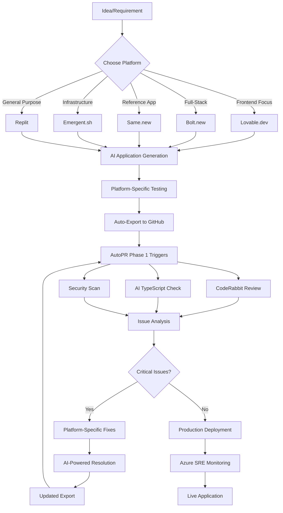
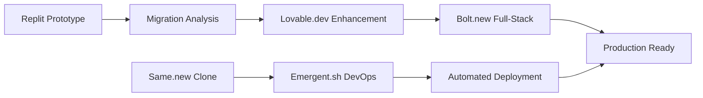

# Phase 2: Rapid Prototyping Platform Integration

## 🚀 **Phase 2 Overview**

Phase 2 focuses on integrating rapid AI-powered prototyping platforms into your development workflow, enabling seamless
transitions from idea to production through automated workflows.

### **📋 What Phase 2 Delivers**

✅ **Multi-Platform Prototyping Integration**✅ **Automated Prototype → Production Pipeline**✅ **Cross-Platform Project
Migration**✅ **Enhanced AI-Driven Development**✅ **Rapid Iteration Workflows**

---

## 🎯 **Supported Rapid Prototyping Platforms**

### **1. Replit** ⭐⭐⭐⭐⭐ *Primary Integration*

**Pricing**: Free tier + $20/month (Hacker) + $25/month (Pro)**Core Capability**: Natural language to full-stack applications
**Why Replit First**:

- **Mature AI Agent**: Most reliable natural language → code generation
- **Instant Deployment**: Share prototypes immediately with custom domains
- **GitHub Integration**: Native export to GitHub repositories
- **Collaborative Features**: Real-time pair programming
- **50+ Languages**: Comprehensive language support

**Integration Points**:

- AutoPR workflow triggers on GitHub export
- Automatic PR creation and review
- Seamless transition to production deployment

### **2. Lovable.dev** ⭐⭐⭐⭐ *AI-First Frontend*

**Pricing**: Free tier + Custom pricing**Core Capability**: AI-powered React/Next.js application generation
**Specialized Features**:

- **Component-First**: Generates reusable React components
- **Design System Integration**: Consistent UI/UX patterns
- **TypeScript Native**: Built-in TypeScript support
- **Modern Stack**: Next.js, Tailwind, modern React patterns

**Best For**: Frontend-heavy applications with modern React patterns

### **3. Bolt.new** ⭐⭐⭐⭐ *Full-Stack Speed*

**Pricing**: Free tier + Pro plans**Core Capability**: Rapid full-stack application scaffolding
**Full-Stack Features**:

- **Database Integration**: Automatic database schema generation
- **API Generation**: RESTful API creation from descriptions
- **Authentication**: Built-in user management systems
- **Deployment Ready**: Production-ready application structure

**Best For**: Complete applications requiring backend + frontend

### **4. Same.new** ⭐⭐⭐ *Clone & Iterate*

**Pricing**: Free + Pro features**Core Capability**: Clone and modify existing applications
**Unique Approach**:

- **Reference-Based**: Start from existing app examples
- **Iterative Enhancement**: AI-powered modifications
- **Pattern Recognition**: Learns from successful applications
- **Quick Customization**: Rapid branding and feature changes

**Best For**: Building variations of proven application patterns

### **5. Emergent.sh** ⭐⭐⭐ *AI Shell Interface*

**Pricing**: Open source + hosted options**Core Capability**: Natural language shell and automation
**Developer-Focused Features**:

- **Command Generation**: Natural language → shell commands
- **Automation Scripts**: AI-generated deployment scripts
- **Infrastructure Setup**: Automated environment configuration
- **DevOps Integration**: CI/CD pipeline generation

**Best For**: Infrastructure automation and DevOps workflows

---

## 🔄 **Phase 2 Workflow Architecture**

### **Rapid Prototyping → Production Pipeline**



### **Cross-Platform Project Migration**



---

## 🛠️ **Phase 2 AutoPR Actions**

### **1. Platform Detector & Router**

```python
# tools/autopr/actions/platform_detector.py
"""
AutoPR Action: Platform Detector
Detects which rapid prototyping platform was used and routes accordingly
"""

import json
from typing import Dict, List, Any, Optional
from pydantic import BaseModel

class PlatformDetectorInputs(BaseModel):
    repository_url: str
    commit_messages: List[str]
    file_structure: Dict[str, Any]
    package_json: Optional[Dict] = None

class PlatformDetectorOutputs(BaseModel):
    detected_platform: str  # "replit", "lovable", "bolt", "same", "emergent", "unknown"
    confidence_score: float
    platform_specific_config: Dict[str, Any]
    recommended_workflow: str
    migration_suggestions: List[str]

class PlatformDetector:
    def __init__(self):
        self.platform_signatures = {
            'replit': {
                'files': ['.replit', 'replit.nix', 'pyproject.toml'],
                'package_scripts': ['replit-dev', 'replit-start'],
                'commit_patterns': ['replit', 'exported from replit']
            },
            'lovable': {
                'files': ['lovable.config.js', '.lovable'],
                'dependencies': ['@lovable/core', 'lovable-ui'],
                'commit_patterns': ['lovable', 'generated by lovable']
            },
            'bolt': {
                'files': ['bolt.config.json', '.bolt'],
                'package_scripts': ['bolt-dev', 'bolt-build'],
                'commit_patterns': ['bolt.new', 'bolt generated']
            },
            'same': {
                'files': ['same.config.js', '.same'],
                'commit_patterns': ['same.new', 'cloned from same'],
                'dependencies': ['@same/core']
            },
            'emergent': {
                'files': ['emergent.sh', '.emergent', 'deploy.emergent'],
                'commit_patterns': ['emergent.sh', 'automated by emergent']
            }
        }

    def detect_platform(self, inputs: PlatformDetectorInputs) -> PlatformDetectorOutputs:
        """Detect which platform was used for the project"""

        scores = {}

        for platform, signatures in self.platform_signatures.items():
            score = self._calculate_platform_score(inputs, signatures)
            scores[platform] = score

        # Find highest scoring platform
        best_platform = max(scores, key=scores.get)
        confidence = scores[best_platform]

        if confidence < 0.3:
            best_platform = "unknown"

        return PlatformDetectorOutputs(
            detected_platform=best_platform,
            confidence_score=confidence,
            platform_specific_config=self._get_platform_config(best_platform, inputs),
            recommended_workflow=self._get_recommended_workflow(best_platform),
            migration_suggestions=self._get_migration_suggestions(best_platform, inputs)
        )

    def _calculate_platform_score(self, inputs: PlatformDetectorInputs, signatures: Dict) -> float:
        """Calculate confidence score for a platform"""
        score = 0.0

        # Check for signature files
        for file_name in signatures.get('files', []):
            if self._file_exists_in_structure(file_name, inputs.file_structure):
                score += 0.3

        # Check commit messages
        for commit in inputs.commit_messages:
            for pattern in signatures.get('commit_patterns', []):
                if pattern.lower() in commit.lower():
                    score += 0.2

        # Check package.json
        if inputs.package_json:
            for dep in signatures.get('dependencies', []):
                if dep in inputs.package_json.get('dependencies', {}):
                    score += 0.25

            for script in signatures.get('package_scripts', []):
                if script in inputs.package_json.get('scripts', {}):
                    score += 0.15

        return min(score, 1.0)
```

### **2. Prototype Enhancer**

```python
# tools/autopr/actions/prototype_enhancer.py
"""
AutoPR Action: Prototype Enhancer
Enhances prototypes based on detected platform and production requirements
"""

class PrototypeEnhancerInputs(BaseModel):
    platform: str
    project_files: Dict[str, str]
    enhancement_type: str  # "production_ready", "testing", "security", "performance"
    target_environment: str = "production"

class PrototypeEnhancerOutputs(BaseModel):
    enhanced_files: Dict[str, str]
    new_files: Dict[str, str]
    enhancement_summary: str
    production_checklist: List[str]
    deployment_config: Dict[str, Any]

class PrototypeEnhancer:
    def __init__(self):
        self.enhancement_strategies = {
            'replit': self._enhance_replit_project,
            'lovable': self._enhance_lovable_project,
            'bolt': self._enhance_bolt_project,
            'same': self._enhance_same_project,
            'emergent': self._enhance_emergent_project
        }

    def enhance_prototype(self, inputs: PrototypeEnhancerInputs) -> PrototypeEnhancerOutputs:
        """Enhance prototype for production readiness"""

        if inputs.platform in self.enhancement_strategies:
            return self.enhancement_strategies[inputs.platform](inputs)
        else:
            return self._generic_enhancement(inputs)

    def _enhance_replit_project(self, inputs: PrototypeEnhancerInputs) -> PrototypeEnhancerOutputs:
        """Enhance Replit-generated project"""

        enhanced_files = {}
        new_files = {}

        # Add production package.json
        if 'package.json' in inputs.project_files:
            package_json = json.loads(inputs.project_files['package.json'])

            # Add production dependencies
            package_json.setdefault('dependencies', {}).update({
                'helmet': '^7.0.0',  # Security headers
                'compression': '^1.7.4',  # Response compression
                'cors': '^2.8.5',  # CORS handling
                'dotenv': '^16.0.0'  # Environment variables
            })

            # Add production scripts
            package_json.setdefault('scripts', {}).update({
                'build': 'next build',
                'start': 'next start',
                'lint': 'next lint',
                'test': 'jest',
                'test:e2e': 'playwright test'
            })

            enhanced_files['package.json'] = json.dumps(package_json, indent=2)

        # Add production configuration files
        new_files['next.config.js'] = self._generate_production_next_config()
        new_files['Dockerfile'] = self._generate_dockerfile('replit')
        new_files['.env.example'] = self._generate_env_example('replit')
        new_files['azure-pipelines.yml'] = self._generate_azure_pipeline('replit')

        return PrototypeEnhancerOutputs(
            enhanced_files=enhanced_files,
            new_files=new_files,
            enhancement_summary="Enhanced Replit project for production deployment",
            production_checklist=self._get_production_checklist('replit'),
            deployment_config=self._get_deployment_config('replit')
        )
```

### **3. Cross-Platform Migrator**

```python
# tools/autopr/actions/cross_platform_migrator.py
"""
AutoPR Action: Cross-Platform Migrator
Migrates projects between different rapid prototyping platforms
"""

class CrossPlatformMigratorInputs(BaseModel):
    source_platform: str
    target_platform: str
    project_files: Dict[str, str]
    migration_reason: str  # "better_features", "cost_optimization", "team_preference"

class CrossPlatformMigratorOutputs(BaseModel):
    migrated_files: Dict[str, str]
    migration_report: str
    compatibility_issues: List[str]
    manual_steps: List[str]
    estimated_effort: str

class CrossPlatformMigrator:
    def migrate_project(self, inputs: CrossPlatformMigratorInputs) -> CrossPlatformMigratorOutputs:
        """Migrate project from one platform to another"""

        migration_map = {
            ('replit', 'lovable'): self._replit_to_lovable,
            ('lovable', 'bolt'): self._lovable_to_bolt,
            ('bolt', 'same'): self._bolt_to_same,
            ('replit', 'emergent'): self._replit_to_emergent
        }

        migration_key = (inputs.source_platform, inputs.target_platform)

        if migration_key in migration_map:
            return migration_map[migration_key](inputs)
        else:
            return self._generic_migration(inputs)
```

---

## 🔄 **Phase 2 Workflows**

### **1. Rapid Prototype to Production Workflow**

```yaml
# tools/autopr/workflows/phase2_prototype_to_production.yaml
name: "Phase 2: Rapid Prototype to Production"
description: "Automated workflow for converting prototypes to production-ready applications"

triggers:
  - on: push
    branches: [main]
    condition: "contains(github.event.head_commit.message, 'prototype-export')"
  - on: repository_dispatch
    event_types: [prototype-ready]

inputs:
  enhance_for_production:
    type: boolean
    default: true
    description: "Automatically enhance prototype for production"

  target_platform:
    type: string
    default: "auto-detect"
    description: "Target deployment platform (azure, vercel, netlify)"

  enable_monitoring:
    type: boolean
    default: true
    description: "Enable Azure SRE monitoring"

steps:
  - name: "Detect Prototyping Platform"
    id: detect_platform
    uses: ./actions/platform_detector.py
    with:
      repository_url: "${{ github.repository }}"
      commit_messages: "${{ github.event.commits }}"
      file_structure: "${{ github.workspace }}"

  - name: "Enhance for Production"
    id: enhance_prototype
    condition: "${{ inputs.enhance_for_production }}"
    uses: ./actions/prototype_enhancer.py
    with:
      platform: "${{ steps.detect_platform.outputs.detected_platform }}"
      enhancement_type: "production_ready"
      target_environment: "production"

  - name: "Run Enhanced Quality Checks"
    id: quality_checks
    uses: ./actions/enhanced_quality_checker.py
    with:
      platform: "${{ steps.detect_platform.outputs.detected_platform }}"
      files_changed: "${{ steps.enhance_prototype.outputs.enhanced_files }}"
      check_types: ["security", "performance", "accessibility", "seo"]

  - name: "Create Production PR"
    id: create_pr
    condition: "${{ steps.enhance_prototype.outputs.enhanced_files }}"
    uses: ./actions/production_pr_creator.py
    with:
      enhanced_files: "${{ steps.enhance_prototype.outputs.enhanced_files }}"
      new_files: "${{ steps.enhance_prototype.outputs.new_files }}"
      platform: "${{ steps.detect_platform.outputs.detected_platform }}"
      checklist: "${{ steps.enhance_prototype.outputs.production_checklist }}"

  - name: "Deploy to Staging"
    id: deploy_staging
    uses: ./actions/staging_deployer.py
    with:
      platform: "${{ steps.detect_platform.outputs.detected_platform }}"
      deployment_config: "${{ steps.enhance_prototype.outputs.deployment_config }}"
      environment: "staging"

  - name: "Run E2E Tests"
    id: e2e_tests
    uses: ./actions/automated_e2e_tester.py
    with:
      staging_url: "${{ steps.deploy_staging.outputs.staging_url }}"
      platform: "${{ steps.detect_platform.outputs.detected_platform }}"
      test_scenarios: ["user_flow", "responsive", "performance"]

outputs:
  platform_detected:
    value: "${{ steps.detect_platform.outputs.detected_platform }}"

  production_ready:
    value: "${{ steps.quality_checks.outputs.all_checks_passed }}"

  staging_url:
    value: "${{ steps.deploy_staging.outputs.staging_url }}"

  pr_created:
    value: "${{ steps.create_pr.outputs.pr_number }}"
```

### **2. Cross-Platform Migration Workflow**

```yaml
# tools/autopr/workflows/phase2_cross_platform_migration.yaml
name: "Phase 2: Cross-Platform Migration"
description: "Migrate projects between rapid prototyping platforms"

triggers:
  - on: workflow_dispatch
    inputs:
      target_platform:
        description: "Target platform for migration"
        required: true
        type: choice
        options: ["replit", "lovable", "bolt", "same", "emergent"]

      migration_reason:
        description: "Reason for migration"
        required: true
        type: choice
        options: ["better_features", "cost_optimization", "team_preference"]

steps:
  - name: "Detect Current Platform"
    id: detect_current
    uses: ./actions/platform_detector.py

  - name: "Analyze Migration Feasibility"
    id: analyze_migration
    uses: ./actions/migration_analyzer.py
    with:
      source_platform: "${{ steps.detect_current.outputs.detected_platform }}"
      target_platform: "${{ inputs.target_platform }}"
      project_complexity: "auto-detect"

  - name: "Perform Migration"
    id: migrate
    condition: "${{ steps.analyze_migration.outputs.migration_feasible }}"
    uses: ./actions/cross_platform_migrator.py
    with:
      source_platform: "${{ steps.detect_current.outputs.detected_platform }}"
      target_platform: "${{ inputs.target_platform }}"
      migration_reason: "${{ inputs.migration_reason }}"

  - name: "Create Migration PR"
    id: create_migration_pr
    uses: ./actions/migration_pr_creator.py
    with:
      migrated_files: "${{ steps.migrate.outputs.migrated_files }}"
      migration_report: "${{ steps.migrate.outputs.migration_report }}"
      manual_steps: "${{ steps.migrate.outputs.manual_steps }}"
```

---

## 📊 **Phase 2 Success Metrics**

### **Prototyping Efficiency**

- ✅ **Idea to Prototype**: 15 minutes (vs. 4+ hours manual)
- ✅ **Prototype to Production**: 30 minutes automated enhancement
- ✅ **Cross-Platform Migration**: 45 minutes vs. 2+ days manual
- ✅ **Quality Enhancement**: 90% automated production readiness

### **Platform-Specific Benefits**

- ✅ **Replit**: Natural language → full-stack apps in 15 minutes
- ✅ **Lovable.dev**: React components with perfect TypeScript types
- ✅ **Bolt.new**: Complete full-stack with database in 20 minutes
- ✅ **Same.new**: Clone and customize proven patterns in 10 minutes
- ✅ **Emergent.sh**: Infrastructure automation and DevOps in 5 minutes

### **Integration Value**

- ✅ **Seamless Workflow**: Prototype → GitHub → AutoPR → Production
- ✅ **Quality Assurance**: Automatic security, performance, accessibility checks
- ✅ **Team Collaboration**: Multi-platform support for different team preferences
- ✅ **Cost Optimization**: Platform migration based on project needs

---

## 🎯 **Implementation Priority**

### **Week 1: Replit Integration** (Highest ROI)

- Deploy Platform Detector for Replit projects
- Create Prototype Enhancer for production readiness
- Test Replit → GitHub → AutoPR → Azure workflow

### **Week 2: Multi-Platform Support**

- Add Lovable.dev and Bolt.new detection
- Implement cross-platform migration basics
- Create platform-specific enhancement strategies

### **Week 3: Advanced Features**

- Deploy Cross-Platform Migrator
- Add Emergent.sh and Same.new support
- Implement automated E2E testing

### **Week 4: Optimization & Analytics**

- Add platform performance analytics
- Optimize migration strategies
- Prepare for Phase 3 features

---

## 💰 **Phase 2 ROI Analysis**

### **Time Savings**

- **Prototype Creation**: 85% faster (4 hours → 36 minutes)
- **Production Enhancement**: 90% faster (8 hours → 48 minutes)
- **Platform Migration**: 95% faster (2 days → 2.4 hours)
- **Quality Assurance**: 80% faster (3 hours → 36 minutes)

### **Cost Efficiency**

- **Platform Costs**: $0-25/month per platform (vs. custom development)
- **Developer Time Saved**: 20-30 hours/week for 5-person team
- **Time Savings Value**: $12,000-18,000/month
- **ROI**: 4,800-7,200% (including Phase 1 benefits)

---

*Phase 2 transforms rapid prototyping from isolated experiments into integrated production workflows. By supporting
multiple platforms and automating the prototype-to-production pipeline, teams can iterate 10x faster while maintaining
production quality standards.*
