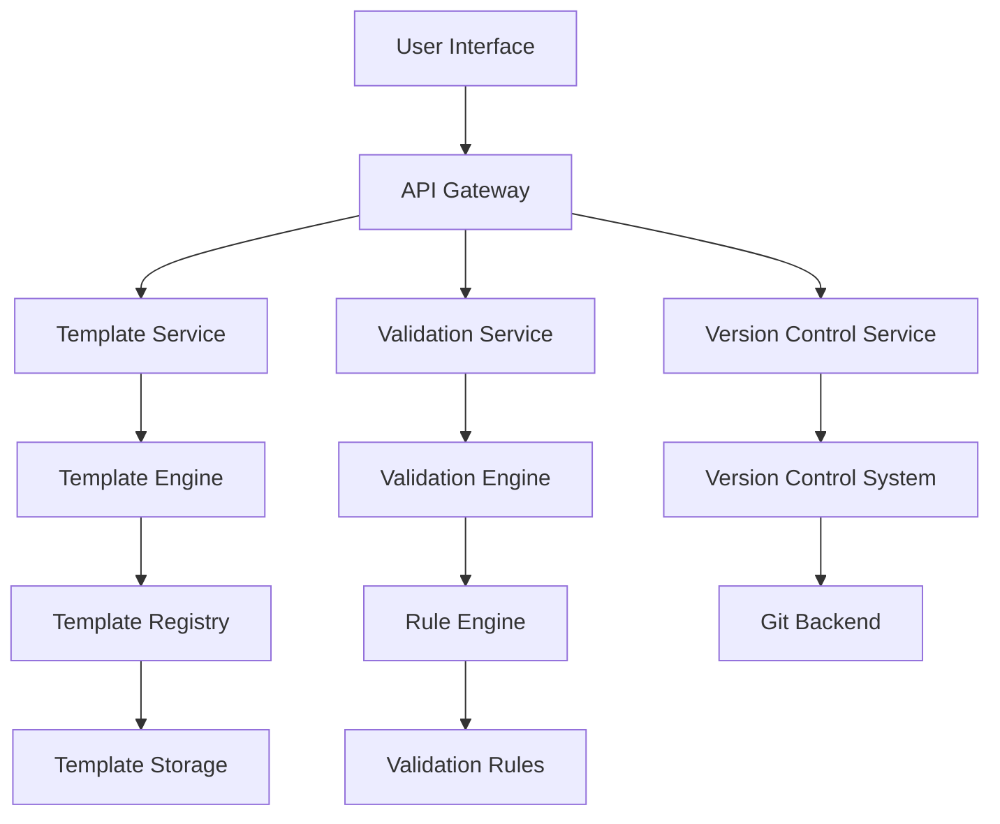

# AutoPR Template Engine Architecture

## Overview

The AutoPR Template Engine is a robust, AI-powered system designed to automate and standardize template management
across development and DevOps workflows. It provides a unified interface for creating, managing, and deploying templates with built-in validation, versioning, and compliance features.

## Core Principles

- **Modularity**: Components are designed as independent, reusable modules
- **Extensibility**: Easy to add new template types, validators, and integrations
- **Security**: Built with security and compliance as first-class citizens
- **Performance**: Optimized for high throughput and low latency
- **Developer Experience**: Intuitive APIs and comprehensive documentation

## System Architecture



### Component Breakdown

#### 1. API Gateway

- **Purpose**: Single entry point for all client requests
- **Features**:
  - Request routing and load balancing
  - Authentication and authorization
  - Rate limiting and throttling
  - Request/response transformation

#### 2. Template Service

- **Template Engine**: Core rendering engine supporting multiple template languages
- **Template Registry**: Central repository for template discovery and management

## AI/ML Integration

### Core AI/ML Capabilities

- **Natural Language Processing**
  - Template structure and variable suggestions using transformer-based models
  - Intent recognition for template authoring assistance
  - Documentation generation from code and templates

### Validation & Optimization

- **Anomaly Detection**
  - Real-time detection of anti-patterns and security vulnerabilities
  - Performance bottleneck identification
  - Cost optimization recommendations for cloud resources

### Intelligent Features

- **Smart Variables**
  - Context-aware type inference and validation
  - Semantic suggestions for variable names and values
  - Dependency analysis for template parameters

### Model Operations

- **Model Hosting**
  - Containerized microservices with Kubernetes orchestration
  - Canary deployments and A/B testing framework
  - Performance monitoring and auto-scaling

- **Model Training**
  - Continuous learning from user feedback
  - Automated retraining pipelines
  - Model versioning and rollback capabilities

#### 3. Validation Service

- **Rule Engine**: Executes validation rules against templates
- **Compliance Checks**: Built-in rules for security and best practices
- **Custom Validators**: Support for user-defined validation logic

#### 4. Version Control Service

- **Git Integration**: Native Git versioning for templates
- **Change Tracking**: Detailed audit trail of all modifications
- **Branching Strategy**: Support for template variants and experiments

## Data Model

### Template

```typescript
interface Template {
  id: string;
  name: string;
  description: string;
  content: string;
  type: TemplateType;
  version: string;
  tags: string[];
  metadata: Record<string, any>;
  createdAt: DateTime;
  updatedAt: DateTime;
  createdBy: User;
  updatedBy: User;
}
```

### Validation Result

```typescript
interface ValidationResult {
  isValid: boolean;
  errors: ValidationError[];
  warnings: ValidationWarning[];
  metadata: Record<string, any>;
}
```

## Integration Points

### CI/CD Integration

- **GitHub Actions**
  - Native workflow templates
  - Status checks and PR decorations

- **GitLab CI**
  - Pipeline templates
  - Merge request integrations

- **Jenkins**
  - Shared library support
  - Pipeline as Code templates

- **CircleCI**
  - Orb integration
  - Custom commands and jobs

### Cloud Providers

- **AWS**
  - CloudFormation templates
  - CDK constructs
  - ECS/EKS task definitions

- **Azure**
  - ARM templates
  - Bicep modules
  - AKS configurations

- **GCP**
  - Deployment Manager templates
  - Terraform modules
  - GKE configurations

- **Multi-Cloud**
  - Terraform modules
  - Crossplane compositions
  - Pulumi packages

### Monitoring & Observability

- **Metrics**
  - Prometheus endpoint
  - Custom business metrics
  - Resource utilization tracking

- **Tracing**
  - Distributed tracing with OpenTelemetry
  - End-to-end request flow visualization
  - Performance bottleneck identification

- **Logging**
  - Structured JSON logging
  - Log aggregation and correlation
  - Anomaly detection

- **Alerting**
  - Custom alert rules
  - Multi-channel notifications
  - Alert correlation and deduplication

## Security & Compliance

### Authentication & Authorization

- **OAuth 2.0 / OIDC** integration with major identity providers
- **Role-Based Access Control (RBAC)** with custom roles
- **Attribute-Based Access Control (ABAC)** for fine-grained permissions
- **Just-In-Time (JIT)** provisioning and deprovisioning

### Data Protection

- **Encryption at rest** using AES-256
- **Encryption in transit** with TLS 1.3+
- **Key management** with hardware security modules (HSM)
- **Data retention** policies with automated cleanup

### Compliance Module

- **Policy as Code**
  - Rego-based policy definitions
  - Automated policy enforcement
  - Drift detection and remediation

- **Audit & Reporting**
  - Immutable audit logs with cryptographic verification
  - Custom report generation
  - Automated evidence collection for compliance audits

- **Standards Support**
  - SOC 2 Type II
  - GDPR (Data Subject Access Requests handling)
  - HIPAA (planned)
  - ISO 27001 (planned)

## Performance & Scalability

### Caching Strategy

- Redis for template caching
- In-memory cache for hot templates
- Distributed cache invalidation

### Scaling

- Horizontal scaling of stateless services
- Automatic scaling based on load
- Multi-region deployment support

## Development Workflow

### Local Development

1. Clone repository
2. Install dependencies: `poetry install`
3. Start services: `docker-compose up -d`
4. Run tests: `pytest`

### CI/CD Pipeline

1. Linting & Type Checking
2. Unit & Integration Tests
3. Security Scanning
4. Container Build & Push
5. Deployment to Staging/Production

## Monitoring & Alerting

### Metrics

- Request rate
- Error rates
- Latency percentiles
- Resource utilization

### Alerts

- Error rate thresholds
- Latency spikes
- Resource constraints
- Security events

## Future Roadmap

### Immediate-term (Q2/Q3 2025)

- [ ] **AutoPR Integration**
- [ ] Native API and workflow support for AutoPR
- [ ] User feedback and usage analytics collection
- [ ] Validation of AI/ML authoring and validation in production
- [ ] Preparation for broader CI/CD and cloud integrations

### Short-term (Q3 2025)

- [ ] Enhanced template sharing
- [ ] Advanced AI/ML features
- [ ] Additional cloud provider support

### Mid-term (Q4 2025)

- [ ] Visual template editor
- [ ] Template marketplace
- [ ] Advanced collaboration features

### Long-term (2026+)

- [ ] **Self-Healing Templates**
- [ ] Automated detection and correction of template drift
- [ ] AI-powered remediation of deprecated APIs and patterns
- [ ] Predictive scaling and optimization

- [ ] **Advanced AI/ML Features**
- [ ] Predictive template suggestions based on project context
- [ ] Natural language to template generation
- [ ] Automated test case generation

- [ ] **Comprehensive Compliance**
- [ ] Automated compliance gap analysis
- [ ] Policy as code with automatic enforcement
- [ ] Cross-region compliance management
